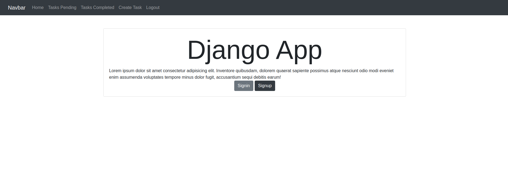

# Aplicación de Gestión de Tareas con Django

Esta es una aplicación web de gestión de tareas desarrollada con Django. Permite a los usuarios crear, organizar y gestionar tareas y subtareas.

## Características

- Registro e inicio de sesión de usuarios
- Creación, edición y eliminación de tareas
- Creación, edición y eliminación de subtareas
- Marcado de tareas y subtareas como completadas
- Reordenamiento de subtareas mediante arrastrar y soltar
- Interfaz responsiva utilizando Bootstrap

## Requisitos

Para ejecutar este proyecto, necesitarás tener instalado:

- Python 3.8+
- Django 5.1
- Otras dependencias listadas en `requirements.txt`

## Instalación

1. Clona este repositorio:
   ```
   git clone <url-del-repositorio>
   ```
2. Crea y activa un entorno virtual:
   ```
   python -m venv venv
   source venv/bin/activate  # En Windows usa `venv\Scripts\activate`
   ```
3. Instala las dependencias:
   ```
   pip install -r requirements.txt
   ```
4. Aplica las migraciones:
   ```
   python manage.py migrate
   ```
5. Crea un superusuario (opcional):
   ```
   python manage.py createsuperuser
   ```

## Ejecución

Para ejecutar el servidor de desarrollo:

```
python manage.py runserver
```

Visita `http://127.0.0.1:8000/` en tu navegador para ver la aplicación.

## Estructura del Proyecto

```
.
├── djangocrud/
│   ├── __init__.py
│   ├── asgi.py
│   ├── settings.py
│   ├── urls.py
│   └── wsgi.py
├── tasks/
│   ├── migrations/
│   ├── templates/
│   │   ├── base.html
│   │   ├── create_subtask.html
│   │   ├── create_task.html
│   │   ├── home.html
│   │   ├── signin.html
│   │   ├── signup.html
│   │   ├── subtask_detail.html
│   │   ├── task_detail.html
│   │   └── tasks.html
│   ├── __init__.py
│   ├── admin.py
│   ├── apps.py
│   ├── forms.py
│   ├── models.py
│   ├── tests.py
│   └── views.py
├── .gitignore
├── manage.py
└── requirements.txt
```

- `djangocrud/`: Directorio principal del proyecto Django
  - `settings.py`: Configuración del proyecto
  - `urls.py`: Configuración de URLs del proyecto
  - `wsgi.py` y `asgi.py`: Configuraciones para despliegue
- `tasks/`: Aplicación principal
  - `migrations/`: Contiene los archivos de migración de la base de datos
  - `templates/`: Plantillas HTML para la interfaz de usuario
  - `admin.py`: Configuración del panel de administración
  - `apps.py`: Configuración de la aplicación
  - `forms.py`: Definición de formularios
  - `models.py`: Modelos de datos
  - `tests.py`: Pruebas unitarias
  - `views.py`: Lógica de las vistas
- `manage.py`: Script de gestión de Django
- `requirements.txt`: Lista de dependencias del proyecto

## Funcionalidades Principales

- **Gestión de Tareas**: Los usuarios pueden crear, editar, eliminar y marcar tareas como completadas.
- **Subtareas**: Cada tarea puede tener múltiples subtareas, que también se pueden gestionar.
- **Reordenamiento**: Las subtareas se pueden reordenar mediante drag and drop.
- **Autenticación**: Sistema de registro e inicio de sesión de usuarios.


## Contacto

Este proyecto fue realizado por estudiantes de la Universidad Laica Eloy Alfaro de Manabí, de la carrera de Software, para la materia de Base de Datos impartida por el Ingeniero Robert Moreira Centeno. Este proyecto es una modificación al taller 81 proporcionado por el ingeniero.

**Integrantes**:
- Joao Elian Moreira Palma
- Kelly Dayana Canchingre Quevedo
- Saul Ivan Castro Muñoz
- Lilibeth Jamileth Pinargote Intriago

**Instructor**:  
Ing. Robert Moreira Centeno

